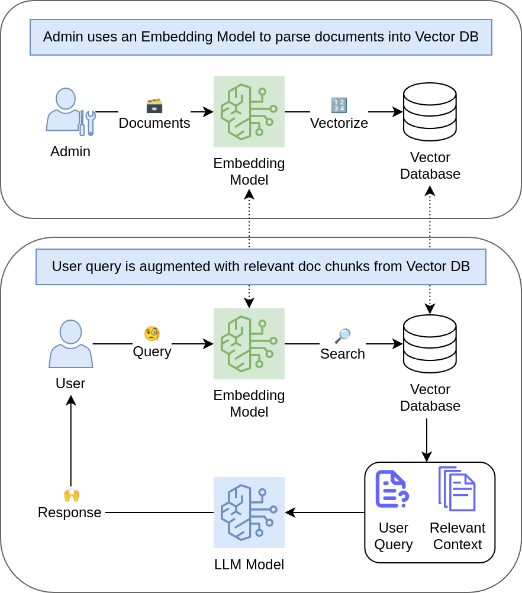

# RAG Chatbot 🚀

[](https://chatrag.net)


A simple RAG (Retrieval-Augmented Generation) [Chatbot app](https://chatrag.net). It queries an LLM with a question that is _augmented_ with the information _retrieved_ from some context. In this case, the context is tax documentation -- Federal Income Tax Guide and Form 1040 Instructions -- though it could be any topic. _The app is for informational & educational purposes only and does not provide a professional tax advice._

[](https://chatrag.net)

### Diagram



### Technologies

- ⛓️‍💥 Langchain for building context-aware LLM chain.
- 🐳 Docker for managing containers.
- 📦 Poetry for packaging and dependency management.
- ⚒️ AWS for hosting & infrastructure.
- 📈 Gradio for web application interface.
- 🔐 Traefik for traffic routing to enable https.

## Running locally 📌

#### 1. Access to AWS

- Create AWS account -- for querying Bedrock API.
- Create a user with relevant permissions and store access credentials in `~/.aws/credentials`

#### 2. Create a Vector Database

- Load your files (e.g., pdf) to `data/raw/`.
- **Choose your embedding model** -- this app uses AWS Titan Embeddings V2, but there are many others.
- Parse your files -- the documents need to be split into chunks.
- **Choose a vector database** -- this app uses Chroma database (it's local and free), but there are many others.
- **Choose an LLM** - this app uses AWS Nova Micro (it's cheap), but there are many others.

To create a vector database, run

```python
poetry run python -m src.db.create_db
```

#### 3a. Interactive Mode

To interact with the RAG model in terminal, run

```python
poetry run python -m src.cli_local
```

#### 3b. Serve locally

To serve the model in a web interface, run

```python
poetry run python -m src.serve_app
```

The app will be served at `http://0.0.0.0:7860/`

## Running remotely (Optional) 📌

#### 3c. Serve via Docker

To build the image and run the container, run

```shell
docker build -t app_name .
docker run -v ~/.aws:/root/.aws -p 7860:7860 -it app_name
```

The app will be served at `http://0.0.0.0:7860/`

#### 4. Deploy to AWS

To deploy this to AWS, we can push the image to ECR. Make sure to replace `<AWS_ACCOUNT>` below with the account number.

```shell
aws ecr get-login-password --region us-east-1 | docker login --username AWS --password-stdin <AWS_ACCOUNT>.dkr.ecr.us-east-1.amazonaws.com
docker tag app_name:latest <AWS_ACCOUNT>.dkr.ecr.us-east-1.amazonaws.com/app_name:latest
docker push <AWS_ACCOUNT>.dkr.ecr.us-east-1.amazonaws.com/app_name:latest
```

Then, ssh into your server, pull the image and run on port 80,

```shell
sudo docker pull <AWS_ACCOUNT>.dkr.ecr.us-east-1.amazonaws.com/app_name:latest
sudo docker run -v ~/.aws:/root/.aws -p 80:7860 -it <AWS_ACCOUNT>.dkr.ecr.us-east-1.amazonaws.com/app_name
```

#### 5. Setting Secure HTTPS (Optional)

To enable HTTPs, the app uses traefik with the following `docker-compose.yml` (needs to have empty `acme.json` in the same directory for storing certificates),

```yml
services:
  traefik:
    image: traefik:v3.3
command:
- "--api.insecure=false"  # Set to true for Traefik dashboard
- "--providers.docker=true"
- "--entrypoints.web.address=:80"
- "--entrypoints.websecure.address=:443"
- "--certificatesresolvers.myresolver.acme.httpChallenge.entryPoint=web"
- "--certificatesresolvers.myresolver.acme.tlschallenge=true"  # "Let's Encrypt" for SSL
- "--certificatesresolvers.myresolver.acme.email=<YOUR_EMAIL>"  # Replace with your email
- "--certificatesresolvers.myresolver.acme.storage=/acme.json"
    ports:
- "80:80"        # HTTP
- "443:443"      # HTTPS
- "8080:8080"    # Expose Dashboard
    volumes:
- "/var/run/docker.sock:/var/run/docker.sock"  # for discovering Docker containers
- "./acme.json:/acme.json"  # Store certificates
    restart: unless-stopped

  gradio-app:
    image: <AWS_ACCOUNT>.dkr.ecr.us-east-1.amazonaws.com/app_name
    labels:
- "traefik.enable=true"
- "traefik.http.routers.gradio-app.rule=Host(`<DOMAIN_NAME>`)"  # Replace with your domain
- "traefik.http.routers.gradio-app.entrypoints=websecure"
- "traefik.http.routers.gradio-app.tls=true"
- "traefik.http.routers.gradio-app.tls.certresolver=myresolver"
- "traefik.http.services.gradio-app.loadbalancer.server.port=<YOUR_PORT>" # Replace with your port
    restart: unless-stopped

  traefik-dashboard:
    image: containous/whoami
    labels:
- "traefik.http.routers.dashboard.rule=Path(`/dashboard`)"
```

You should be able to run the app with `sudo docker compose up -d` on your domain.
